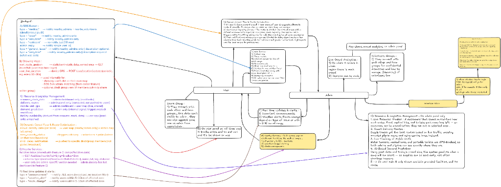

# 🚩 VariMitra (Smart Wari)
### *Every Step with Every Warkari — Smart Crowd, Mobility & Resource Management Platform*

[](https://www.djangoproject.com/)
[](https://react.dev/)
[](https://tailwindcss.com/)
[](https://www.postgresql.org/)
[](https://firebase.google.com/)
[](https://www.openstreetmap.org/)

---

## 📌 Table of Contents
- [1. Problem Statement](#1-problem-statement)
- [2. Our Solution](#2-our-solution)
- [3. Core Feature Pillars](#3-core-feature-pillars)
  - [A. Dynamic Crowd Flow & Route Optimization](#a-dynamic-crowd-flow--route-optimization)
  - [B. Resource & Logistics Management](#b-resource--logistics-management)
  - [C. Transport & Infrastructure Efficiency](#c-transport--infrastructure-efficiency)
  - [D. Supporting Ecosystem Features](#d-supporting-ecosystem-features)
- [4. Technology Stack](#4-technology-stack)
- [5. System Architecture](#5-system-architecture)
  - [System Architecture Blueprint](#-system-architecture-blueprint)
  - [End-to-End Workflow Diagram](#-end-to-end-workflow-diagram)
- [6. Application Screenshots](#6-application-screenshots)
  - [👨‍💼 Admin Command Center](#-admin-command-center)
  - [🙋‍♂️ Volunteer (Sevekar) Portal](#️-volunteer-sevekar-portal)
  - [🚶‍♂️ Pilgrim (Warkari Devotee) Portal](#️-pilgrim-warkari-devotee-portal)
- [7. Quickstart & Local Setup](#7-quickstart--local-setup)
- [8. Team & License](#8-team--license)

---

## 1. Problem Statement

The **Pandharpur Wari** is one of India's oldest and largest annual pilgrimages, attracting millions (*lakhs*) of Warkaris who travel on foot across **200+ kilometers** from Alandi and Dehu to the holy shrine of Lord Vitthal in Pandharpur.

Beyond severe communication and medical safety vulnerabilities across rural stretches, the pilgrimage faces major systemic challenges:
- **Unregulated Crowd Influx & Critical Chokepoints:** Narrow road corridors, ghat sections, and river bridges encounter sudden surges in pedestrian density, creating dangerous stampede risks.
- **Resource Imbalance & Inefficient Logistics:** Without live consumption data, severe shortages of potable drinking water, food (*Annachatra*), medical supplies, and mobile sanitation occur in high-density sectors, while other camps have surplus stock.
- **Uncoordinated Transport & Emergency Access Blockages:** Vital support vehicles (water tankers, ambulances, mobile clinics, police escorts) frequently get trapped in pedestrian columns, delaying life-saving emergency responses.
- **Fragmented Infrastructure Monitoring:** Manual oversight fails to identify overflowing waste bins, damaged public amenities, or water pipeline leakages along the route in real time.

As participation expands exponentially each year, traditional manual policing and reactive incident handling are insufficient. There is an urgent need for an **integrated, intelligent, and data-driven platform** that proactively regulates crowd flow, optimizes mobility corridors, and balances resource distribution across the entire pilgrimage while preserving its sacred spiritual heritage.

---

## 2. Our Solution

We propose **Smart Wari (VariMitra)** — an integrated digital platform purpose-built for the **Crowd, Mobility & Resource Management** track. 

Smart Wari unites **Pilgrims (Warkaris)**, **Field Volunteers (Sevekars)**, **Emergency Logistics & Transport Teams**, and **Administrative Command Centers** into a single, synchronized operational ecosystem.

Moving from *reactive monitoring* to *predictive, data-driven operational control*, the platform combines a mobile-first responsive web application, cloud-based asynchronous backend, AI-powered crowd & route analytics, GPS telemetry, and a central command dashboard to actively govern crowd flow, maintain open emergency corridors, and balance resources in real time.

```
┌─────────────────┐       ┌──────────────────────────────┐       ┌─────────────────┐
│     PILGRIM     │ <---> │     SMART WARI PLATFORM      │ <---> │  ADMIN COMMAND  │
│  (Mobile App)   │       │  • Real-time Telemetry       │       │    (Center)     │
└─────────────────┘       │  • AI Crowd & Route Engine   │       └─────────────────┘
                          │  • Geofenced Capacity Zones  │
┌─────────────────┐       │  • Multi-Tier SOS Engine     │       ┌─────────────────┐
│    VOLUNTEER    │ <---> │  • Predictive Logistics Hub  │ <---> │ EMERGENCY TEAMS │
│ (Sevekar App)   │       └──────────────────────────────┘       │  (Ambulances)   │
└─────────────────┘                                              └─────────────────┘
```

---

## 3. Core Feature Pillars

### A. Dynamic Crowd Flow & Route Optimization
* **AI-Based Route Load Balancing:** Actively monitors pedestrian density along route segments and pushes alternate path suggestions in real time when a stretch crosses safe density thresholds — similar to live traffic rerouting, applied to mass foot traffic.
* **Geofenced Capacity Zones:** Partitions the 200+ km route into virtual zones with predefined maximum safe capacities. As a zone approaches capacity, the system triggers automated entry-throttling advisories for volunteers and police at boundary checkpoints.
* **Digital Twin & Predictive Simulation:** Simulates the entire route using historical progression velocity and real-time GPS telemetry, predicting congestion bottlenecks **30–60 minutes before they physically form**.
* **Time-Staggered Entry Advisories:** Sends targeted notifications advising pilgrim groups (*Dindis*) to adjust departure times by 10–15 minutes from camps to flatten crowd peaks at bottleneck junctions.

---

### B. Resource & Logistics Management
* **Dynamic Resource Heatmap:** A live dashboard displaying real-time consumption and remaining stock of drinking water, food, medical kits, and sanitation facilities per camp, enabling proactive reallocation before shortages occur.
* **Smart Supply Delivery Routing:** Calculates optimal delivery-vehicle routes using real-time foot-traffic data, ensuring supply trucks avoid pedestrian-heavy columns and utilize designated service lanes.
* **Mobile Resource Unit (MRU) GPS Tracking:** GPS-tags water tankers, mobile medical vans, and portable toilet units so both administrators and pilgrims can track their live locations on interactive maps.
* **AI-Based Predictive Restocking:** Combines past consumption patterns with real-time crowd velocity to forecast when a camp will run low on essentials, triggering pre-emptive dispatches instead of reactive deliveries.

---

### C. Transport & Infrastructure Efficiency
* **Smart Support Vehicle & Parking Coordination:** Slot-booking and live parking-availability tracking for support vehicles, ambulances, and volunteer transports near key checkpoints, preventing road jams that block emergency lanes.
* **Dedicated Emergency Green Corridors:** App-guided, dynamically shifting virtual green corridors that ensure ambulances and relief vehicles always maintain an unobstructed path, broadcasting clearing instructions to nearby field volunteers.
* **Infrastructure Load & Sanitation Monitoring:** Tracks usage and wear indicators (sanitation frequency, bridge/narrow-point crossing counts) and provides digital waste bin overflow reporting (`/api/garbage/dustbins/`) with one-click cleanup dispatch.

---

### D. Supporting Ecosystem Features
* **Pilgrim Portal (Warkari App):** Live Palkhi telemetry, 2 km nearby facility finder (food, water, medical, toilets), one-tap emergency SOS, Dindi community chat, and multi-language support (Marathi, Hindi, English).
* **Admin Command Center:** Real-time crowd heatmaps, centralized SOS triage inbox with automated geospatial nearest-responder mapping, broadcast announcement center, and volunteer approval management.
* **Volunteer Portal (Sevekar App):** Centralized onboarding with administrator verification, duty status switcher (`On Duty` / `Off Duty`), squad management, and real-time task dispatches.
* **Multi-Tier SOS & Notification Engine:** One-tap emergency dispatches categorized by type (`Medical`, `Lost Person`, `Missing Item`, `Sanitation`, `General Issue`) with dual-channel simultaneous alerts to nearby admins and active volunteers within a 2 km radius.

---

## 4. Technology Stack

| Layer | Technologies Used | Description |
| :--- | :--- | :--- |
| **Frontend UI** | **React 19, TypeScript, Vite** | Fast, responsive Single Page Application (SPA) with native PWA support |
| **Styling & Design** | **Tailwind CSS, Lucide Icons** | Sacred aesthetic with gold/amber hues, glassmorphic UI cards, and dark/light modes |
| **Backend API** | **Django 5, Django REST Framework (DRF)** | High-throughput asynchronous REST API (`accounts`, `sos`, `wari_core`, `alerts`, `crowdflow`) |
| **Realtime Engine** | **Django Channels, Daphne, WebSockets** | Real-time bi-directional telemetry, Dindi group chat, and instant push dispatches |
| **Database** | **PostgreSQL / SQLite** | Relational spatial database indexing GPS coordinates, Dindis, user profiles, and resource states |
| **Authentication** | **Firebase Authentication & JWT** | Hybrid authentication supporting Google OAuth 2.0, Firebase Email/Password, and OTP Mobile verification |
| **Mapping & GIS** | **Leaflet, OpenStreetMap, GeoJSON** | Interactive map layers, custom sacred Palkhi route overlays, Haversine geospatial calculations, and geofencing |

---

## 5. System Architecture

### 📐 System Architecture Blueprint
The diagram below outlines the core architectural structure connecting the client portals, asynchronous Django backend, GIS geospatial engine, resource tracking modules, and multi-tier notification dispatcher:



---

### 🔄 End-to-End Workflow Diagram

```mermaid
flowchart TB
    %% Subgraphs & Boundaries
    subgraph Clients["📱 Client Interfaces & Portals"]
        UserApp["🚶 Pilgrim / User App\n(GPS Pings, SOS, 2km Services, Dindi Chat)"]
        VolunteerApp["🙋 Volunteer / Sevekar App\n(Duty Status, Squads, Task Dispatch)"]
        AdminDashboard["👨‍💼 Admin Command Center\n(Live Heatmaps, SOS Hub, Logistics, Approvals)"]
    end

    subgraph AuthLayer["🔐 Authentication & Access Control"]
        FirebaseAuth["Firebase Auth\n(Google Sign-In / Phone / Email)"]
        DjangoAuth["Django Role Gatekeeper\n(Pilgrim | Volunteer | Admin)"]
    end

    subgraph CoreBackend["⚙️ Django REST & Asynchronous Core"]
        API_Root["API Gateway & Router\n(/api/)"]
        
        subgraph SOS_Engine["🚨 Emergency SOS Subsystem"]
            SOS_Handler["SOS Dispatcher (/api/sos/)"]
            SOS_Router{"Alert Type?"}
            SOS_Med["Medical: Push to Nearby Admins + Volunteers"]
            SOS_Admin["Issue / Lost: Push to Nearby Admins"]
            SOS_DB["Restroom / General: DB Log"]
            SOS_Reply["Admin Reply -> Direct Push to Reporter"]
        end

        subgraph Telemetry_GIS["🗺️ Spatial & Telemetry Engine"]
            GeoJSON_Store["Wari Route GeoJSON\n(Static Layer)"]
            Location_Tracker["User GPS Tracking\n(10-30s Periodic Pings)"]
            Nearby_Filter["Haversine 2km Proximity Filter\n(Medical, Food, Water, Sanitation)"]
        end

        subgraph Crowd_Logistics["📊 Crowd Flow & Resource Optimization"]
            Crowd_Analyzer["AI Crowd Density Engine\n(Geofenced Zone Monitor)"]
            Capacity_Trigger["Capacity Limit Trigger\n(Zone Entry Throttling)"]
            Resource_Tracker["Dynamic Resource Tracker\n(Camps Stock: Water, Food, Meds)"]
            Supply_Router["Smart Supply Route Optimizer\n(Service-Lane Navigation)"]
            Demand_Predictor["AI Demand Predictor\n(Pre-emptive Restocking Signal)"]
            MRU_GPS["Mobile Resource Unit (MRU) GPS\n(Water Tankers, Mobile Clinics)"]
        end

        subgraph Comms_Hub["📢 Notification & Dindi Engine"]
            Broadcast_Hub["Real-time Alerts Broadcast\n• Announcements (All)\n• Weather (5-10km)\n• Route Diversions (5-10km)"]
            Dindi_Hub["Dindi Group Chat & Telemetry\n(Private Group Channels)"]
        end
    end

    subgraph DataStore["💾 Data Layer"]
        DB[(PostgreSQL / SQLite Database)]
    end

    %% Client Interactions & Routing
    UserApp -->|Sign In / Sign Up| FirebaseAuth
    VolunteerApp -->|Access Request| FirebaseAuth
    AdminDashboard -->|Staff Auth| FirebaseAuth
    FirebaseAuth --> DjangoAuth
    DjangoAuth --> API_Root

    %% User Actions
    UserApp -->|POST /api/sos/report/| SOS_Handler
    UserApp -->|Periodic GPS Ping| Location_Tracker
    UserApp -->|GET /api/resources/nearby/| Nearby_Filter
    UserApp -->|Chat & Member Pings| Dindi_Hub

    %% SOS Processing
    SOS_Handler --> SOS_Router
    SOS_Router -->|Medical| SOS_Med
    SOS_Router -->|Issue/Lost| SOS_Admin
    SOS_Router -->|General| SOS_DB
    SOS_Med -->|Push Alert| VolunteerApp
    SOS_Med -->|Push Alert| AdminDashboard
    SOS_Admin -->|Push Alert| AdminDashboard
    AdminDashboard -->|Post Reply| SOS_Reply
    SOS_Reply -->|Push Update| UserApp

    %% Spatial & Mapping Flow
    API_Root --> GeoJSON_Store
    GeoJSON_Store --> UserApp
    GeoJSON_Store --> AdminDashboard
    Location_Tracker --> DB
    Nearby_Filter --> UserApp

    %% Crowd & Logistics Flow
    Location_Tracker --> Crowd_Analyzer
    Crowd_Analyzer --> Capacity_Trigger
    Capacity_Trigger -->|Entry Advisory| VolunteerApp
    Capacity_Trigger -->|Throttling Alert| AdminDashboard
    Crowd_Analyzer -->|Zone Heatmap| AdminDashboard
    Crowd_Analyzer -->|Diversion Path| UserApp

    Resource_Tracker --> AdminDashboard
    Demand_Predictor --> Resource_Tracker
    Supply_Router --> AdminDashboard
    MRU_GPS --> AdminDashboard
    MRU_GPS --> UserApp

    %% Broadcast Flow
    AdminDashboard -->|Trigger Broadcast| Broadcast_Hub
    Broadcast_Hub --> UserApp
    Broadcast_Hub --> VolunteerApp

    %% Persistence
    CoreBackend --> DB
```



---

## 6. Application Screenshots

### 👨‍💼 Admin Command Center
The central command console gives festival administrators, police units, and medical coordinators full operational visibility.

| Live Real-time Overview | Emergency SOS Triage & Management |
| :---: | :---: |
|  |  |

| Volunteer Approvals & Squad Roster | Crowd Density & Foot-traffic Analytics |
| :---: | :---: |
|  |  |

| Emergency Broadcast Console | Infrastructure & Waste Management |
| :---: | :---: |
|  |  |

| Real-time Map & Resource Telemetry | Incident Resolution Modal |
| :---: | :---: |
|  |  |

---

### 🙋‍♂️ Volunteer (Sevekar) Portal
Tailored for on-ground volunteers featuring squad assignments, duty status switches, and rapid incident response tools.

| Volunteer Onboarding & Duty Hub | Instant Incident Response & Tasks |
| :---: | :---: |
|  |  |

| Squad Coordination & Chat | Live Field Task Map |
| :---: | :---: |
|  |  |

| Emergency Dispatch Notifications | Profile & Verification Status |
| :---: | :---: |
|  |  |

---

### 🚶‍♂️ Pilgrim (Warkari Devotee) Portal
A lightweight, spiritually enriching interface offering essential safety, map guidance, and community support in Marathi, Hindi, and English.

| Landing & Sacred Welcome | Interactive Wari Map & Palkhi Route |
| :---: | :---: |
|  |  |

| 2 km Proximity Facility Finder | One-Tap Emergency SOS Dispatcher |
| :---: | :---: |
|  |  |

| Dindi Community Group & Messaging | Multi-Language Portal Selector |
| :---: | :---: |
|  |  |

| Live Weather & Environmental Alerts | User Profile & Devotee Card |
| :---: | :---: |
|  |  |

| Sanitation & Dustbin Reporting |
| :---: |
|  |

---

## 7. Quickstart & Local Setup

### Prerequisites
- **Python 3.10+**
- **Node.js 18+ & npm**
- **Git**

### Step 1: Clone Repository
```powershell
git clone https://github.com/sagarpc1006/Varithon.git
cd Varithon
```

### Step 2: Backend Setup (Django)
```powershell
cd backend
python -m venv venv
.\venv\Scripts\activate

# Install dependencies
pip install -r requirements.txt

# Run migrations
python manage.py migrate

# Start development server
python manage.py runserver
```
*Backend API will run at `http://127.0.0.1:8000`.*

### Step 3: Frontend Setup (React + Vite)
```powershell
# Open a new terminal
cd frontend
npm install

# Start Vite dev server
npm run dev
```
*Frontend will run at `http://localhost:5173`.*

---

## 8. Team & License

Developed with devotion for the safety and well-being of every Warkari undertaking the sacred journey to Pandharpur.

Released under the [MIT License](LICENSE).  
**राम कृष्ण हरी! 🚩 जय हरी विठ्ठल!**
