```mermaid
flowchart TB
    %% Subgraphs & Boundaries
    subgraph Clients["📱 Client Interfaces & Portals"]
        UserApp["🚶 Pilgrim / User App\n(GPS Pings, SOS, 2km Services, Dindi Chat)"]
        VolunteerApp["🙋 Volunteer / Sevekar App\n(Duty Status, Squads, Task Dispatch)"]
        AdminDashboard["👨‍💼 Admin Command Center\n(Live Heatmaps, SOS Hub, Logistics, Approvals)"]
    end

    subgraph AuthLayer["🔐 Authentication & Access Control"]
        FirebaseAuth["Firebase Auth\n(Google Sign-In / Phone / Email)"]
        DjangoAuth["Django Role Gatekeeper\n(Pilgrim | Volunteer | Admin)"]
    end

    subgraph CoreBackend["⚙️ Django REST & Asynchronous Core"]
        API_Root["API Gateway & Router\n(/api/)"]
        
        subgraph SOS_Engine["🚨 Emergency SOS Subsystem"]
            SOS_Handler["SOS Dispatcher (/api/sos/)"]
            SOS_Router{"Alert Type?"}
            SOS_Med["Medical: Push to Nearby Admins + Volunteers"]
            SOS_Admin["Issue / Lost: Push to Nearby Admins"]
            SOS_DB["Restroom / General: DB Log"]
            SOS_Reply["Admin Reply -> Direct Push to Reporter"]
        end

        subgraph Telemetry_GIS["🗺️ Spatial & Telemetry Engine"]
            GeoJSON_Store["Wari Route GeoJSON\n(Static Layer)"]
            Location_Tracker["User GPS Tracking\n(10-30s Periodic Pings)"]
            Nearby_Filter["Haversine 2km Proximity Filter\n(Medical, Food, Water, Sanitation)"]
        end

        subgraph Crowd_Logistics["📊 Crowd Flow & Resource Optimization"]
            Crowd_Analyzer["AI Crowd Density Engine\n(Geofenced Zone Monitor)"]
            Capacity_Trigger["Capacity Limit Trigger\n(Zone Entry Throttling)"]
            Resource_Tracker["Dynamic Resource Tracker\n(Camps Stock: Water, Food, Meds)"]
            Supply_Router["Smart Supply Route Optimizer\n(Service-Lane Navigation)"]
            Demand_Predictor["AI Demand Predictor\n(Pre-emptive Restocking Signal)"]
            MRU_GPS["Mobile Resource Unit (MRU) GPS\n(Water Tankers, Mobile Clinics)"]
        end

        subgraph Comms_Hub["📢 Notification & Dindi Engine"]
            Broadcast_Hub["Real-time Alerts Broadcast\n• Announcements (All)\n• Weather (5-10km)\n• Route Diversions (5-10km)"]
            Dindi_Hub["Dindi Group Chat & Telemetry\n(Private Group Channels)"]
        end
    end

    subgraph DataStore["💾 Data Layer"]
        DB[(PostgreSQL / SQLite Database)]
    end

    %% Client Interactions & Routing
    UserApp -->|Sign In / Sign Up| FirebaseAuth
    VolunteerApp -->|Access Request| FirebaseAuth
    AdminDashboard -->|Staff Auth| FirebaseAuth
    FirebaseAuth --> DjangoAuth
    DjangoAuth --> API_Root

    %% User Actions
    UserApp -->|POST /api/sos/report/| SOS_Handler
    UserApp -->|Periodic GPS Ping| Location_Tracker
    UserApp -->|GET /api/resources/nearby/| Nearby_Filter
    UserApp -->|Chat & Member Pings| Dindi_Hub

    %% SOS Processing
    SOS_Handler --> SOS_Router
    SOS_Router -->|Medical| SOS_Med
    SOS_Router -->|Issue/Lost| SOS_Admin
    SOS_Router -->|General| SOS_DB
    SOS_Med -->|Push Alert| VolunteerApp
    SOS_Med -->|Push Alert| AdminDashboard
    SOS_Admin -->|Push Alert| AdminDashboard
    AdminDashboard -->|Post Reply| SOS_Reply
    SOS_Reply -->|Push Update| UserApp

    %% Spatial & Mapping Flow
    API_Root --> GeoJSON_Store
    GeoJSON_Store --> UserApp
    GeoJSON_Store --> AdminDashboard
    Location_Tracker --> DB
    Nearby_Filter --> UserApp

    %% Crowd & Logistics Flow
    Location_Tracker --> Crowd_Analyzer
    Crowd_Analyzer --> Capacity_Trigger
    Capacity_Trigger -->|Entry Advisory| VolunteerApp
    Capacity_Trigger -->|Throttling Alert| AdminDashboard
    Crowd_Analyzer -->|Zone Heatmap| AdminDashboard
    Crowd_Analyzer -->|Diversion Path| UserApp

    Resource_Tracker --> AdminDashboard
    Demand_Predictor --> Resource_Tracker
    Supply_Router --> AdminDashboard
    MRU_GPS --> AdminDashboard
    MRU_GPS --> UserApp

    %% Broadcast Flow
    AdminDashboard -->|Trigger Broadcast| Broadcast_Hub
    Broadcast_Hub --> UserApp
    Broadcast_Hub --> VolunteerApp

    %% Persistence
    CoreBackend --> DB
```

# 🚩 VariMitra (Smart Wari)
### *Every Step with Every Warkari — Smart Crowd, Mobility & Resource Management Platform*

[](https://www.djangoproject.com/)
[](https://react.dev/)
[](https://tailwindcss.com/)
[](https://www.postgresql.org/)
[](https://firebase.google.com/)
[](https://www.openstreetmap.org/)

---

## 📌 Table of Contents
- [1. Problem Statement](#1-problem-statement)
- [2. Our Solution](#2-our-solution)
- [3. Core Feature Pillars](#3-core-feature-pillars)
  - [A. Dynamic Crowd Flow & Route Optimization](#a-dynamic-crowd-flow--route-optimization)
  - [B. Resource & Logistics Management](#b-resource--logistics-management)
  - [C. Transport & Infrastructure Efficiency](#c-transport--infrastructure-efficiency)
  - [D. Supporting Ecosystem Features](#d-supporting-ecosystem-features)
- [4. Technology Stack](#4-technology-stack)
- [5. System Architecture](#5-system-architecture)
- [6. Application Screenshots](#6-application-screenshots)
  - [👨‍💼 Admin Command Center](#-admin-command-center)
  - [🙋‍♂️ Volunteer (Sevekar) Portal](#️-volunteer-sevekar-portal)
  - [🚶‍♂️ Pilgrim (Warkari Devotee) Portal](#️-pilgrim-warkari-devotee-portal)
- [7. Quickstart & Local Setup](#7-quickstart--local-setup)
- [8. Team & License](#8-team--license)

---

## 1. Problem Statement

The **Pandharpur Wari** is one of India's oldest and largest annual pilgrimages, attracting millions (*lakhs*) of Warkaris who walk over **200 kilometers** across Maharashtra to seek the blessings of Lord Vitthal. 

Beyond severe communication and safety vulnerabilities in remote terrains, the pilgrimage experiences:
- **Unregulated Crowd Influx & Severe Chokepoints:** Narrow road stretches, river ghats, and bridges encounter uncontrolled density spikes, risking crowd surges and stampedes.
- **Supply & Resource Imbalances:** Lack of dynamic tracking creates acute shortages of drinking water, medical kits, and sanitation in high-density sectors while surplus stock sits underutilized in other camps.
- **Uncoordinated Logistics & Traffic Gridlocks:** Essential service vehicles (water tankers, ambulances, mobile clinics) get trapped in dense pedestrian columns due to unmanaged route sharing.
- **Fragmented Infrastructure Monitoring:** Manual, static oversight fails to detect overfilled waste bins, damaged amenities, or water pipeline outages in real time.

As participation expands every year, traditional manual crowd policing and reactive incident response are no longer sufficient. There is an urgent need for an **intelligent, data-driven system** that proactively regulates crowd movement, optimizes mobility corridors, and balances resource distribution across the 200+ km corridor while honoring the spiritual sanctity of the Yatra.

---

## 2. Our Solution

We present **Smart Wari (VariMitra)** — an integrated, cloud-native platform specifically engineered for the **Crowd, Mobility & Resource Management** track. 

Smart Wari unites **Pilgrims (Warkaris)**, **Field Volunteers (Sevekars)**, **Emergency Logistics Teams**, and **Administrative Command Centers** into a single, synchronized operational ecosystem. Moving from *reactive monitoring* to *predictive, data-driven operational control*, the platform leverages real-time GPS telemetry, geofenced capacity algorithms, AI-powered foot-traffic load balancing, and rapid emergency dispatch to keep every pilgrim safe, informed, and supported.

```
┌─────────────────┐       ┌──────────────────────────────┐       ┌─────────────────┐
│     PILGRIM     │ <---> │     SMART WARI PLATFORM      │ <---> │  ADMIN COMMAND  │
│  (Mobile App)   │       │  • Real-time Telemetry       │       │    (Center)     │
└─────────────────┘       │  • AI Crowd & Route Engine   │       └─────────────────┘
                          │  • Geofenced Capacity Zones  │
┌─────────────────┐       │  • Multi-Tier SOS Engine     │       ┌─────────────────┐
│    VOLUNTEER    │ <---> │  • Predictive Logistics Hub  │ <---> │ EMERGENCY TEAMS │
│ (Sevekar App)   │       └──────────────────────────────┘       │  (Ambulances)   │
└─────────────────┘                                              └─────────────────┘
```

---

## 3. Core Feature Pillars

### A. Dynamic Crowd Flow & Route Optimization
* **AI-Powered Route Load Balancing:** Continuously monitors foot-traffic density across all walking segments. When a sector approaches its safe threshold, the engine automatically calculates alternate bypass trails and pushes localized diversion advisories to approaching pilgrim groups (*Dindis*).
* **Geofenced Capacity Zones:** Partitions the 200+ km route into virtual micro-zones with strictly defined maximum capacity limits. As a zone reaches 80%+ saturation, boundary throttles and alert notifications are dispatched to nearby field volunteers and police checkpoints.
* **Digital Twin & Predictive Congestion Simulation:** Models historical procession velocity alongside live GPS pings to simulate walking dynamics and forecast bottlenecks **30–60 minutes before they physically manifest**.
* **Time-Staggered Dindi Departure Advisories:** Sends targeted notifications to registered Dindi heads advising them to delay or advance camp departures by 10–15 minutes, successfully flattening peak crowd curves at critical junctions.

---

### B. Resource & Logistics Management
* **Dynamic Resource Heatmap:** Real-time administrative dashboard mapping stock consumption rates for potable water, Annachatra food, medical essentials, and mobile toilets across every transit camp.
* **Smart Supply Routing for Replenishment:** Dynamically calculates detour and service-lane navigation for supply trucks, preventing heavy logistics vehicles from conflicting with dense pedestrian processions.
* **Mobile Resource Unit (MRU) Telemetry:** Live GPS tagging for water tankers, mobile medical vans, and tractor-mounted sanitation units, making critical mobile assets discoverable by pilgrims and dispatchable by administrators.
* **AI Predictive Restocking:** Analyzes historical consumption curves and real-time crowd velocity to automatically trigger restock orders before camps run out of vital supplies.

---

### C. Transport & Infrastructure Efficiency
* **Smart Support Vehicle & Parking Coordination:** Real-time parking slot discovery and reservation for Dindi support vehicles, emergency ambulances, and government escorts near checkpoints, eliminating roadway blockages.
* **Virtual Green Emergency Corridors:** Real-time routing engine that establishes dynamically clear corridors for ambulances and quick-response teams, broadcasting immediate path-clearing instructions to nearby volunteers.
* **Infrastructure Load & Sanitation Monitoring:** Live reporting for sanitation facility utilization, structural strain at bridge crossings, and digital waste bin overflow tracking (`/api/garbage/dustbins/`) with one-click cleanup dispatch.

---

### D. Supporting Ecosystem Features
* **Pilgrim Portal (Warkari App):** 
  - Real-time Palkhi location telemetry and ETA countdowns.
  - Interactive OpenStreetMap with 2 km radius filtering for food, water, medical camps, and toilets.
  - Multi-language support (English, Marathi, Hindi).
  - Dindi group formation, internal messaging, and offline emergency contacts.
* **Admin Command Center:**
  - Bird's-eye live operational map with crowd density heatmaps.
  - Emergency SOS triaging inbox with automated geospatial nearest-responder mapping.
  - Broadcast center for emergency weather, route changes, and general advisories.
  - Volunteer approval, squad management, and task delegation dashboard.
* **Volunteer (Sevekar) Portal:**
  - Secure role-based onboarding with central administrator verification.
  - Immediate duty status toggle (`On Duty` / `Off Duty`).
  - Automated dispatch to verified medical emergencies and nearby crowd bottlenecks.
* **Multi-Tier Emergency SOS Engine:**
  - Instant one-tap emergency triggers (`Medical`, `Lost Person`, `Missing Item`, `Sanitation`, `General Issue`).
  - Dual-channel broadcast delivering simultaneous push alerts to verified administrators and active field volunteers within a 2 km radius.

---

## 4. Technology Stack

| Layer | Technologies Used | Description |
| :--- | :--- | :--- |
| **Frontend UI** | **React 19, TypeScript, Vite** | Responsive, modern Single Page Application (SPA) / PWA with micro-interactions |
| **Styling & Design** | **Tailwind CSS, Lucide Icons** | Custom spiritual aesthetic with bronze/gold palettes, glassmorphic HUDs, and dark mode support |
| **Backend API** | **Django 5, Django REST Framework (DRF)** | High-throughput asynchronous REST API with modular apps (`accounts`, `sos`, `wari_core`, `alerts`, `crowdflow`) |
| **Realtime Engine** | **Django Channels, Daphne, WebSockets** | Bi-directional communication for live telemetry, chat, and instant push dispatches |
| **Database** | **PostgreSQL / SQLite** | Relational spatial storage indexing GPS points, Dindi groups, user profiles, and resource states |
| **Authentication** | **Firebase Auth & JWT / Django Session** | Hybrid authentication supporting Google OAuth 2.0, Firebase Email/Password, and OTP Mobile verification |
| **Mapping & GIS** | **Leaflet, OpenStreetMap, GeoJSON** | Real-time map rendering, custom sacred route layers, Haversine distance calculations, and geofencing |

---

## 5. System Architecture

The following architecture diagram illustrates the end-to-end telemetry flow, role isolation, and automated dispatch pathways across the **Smart Wari (VariMitra)** ecosystem:



---

## 6. Application Screenshots

### 👨‍💼 Admin Command Center
The central command console gives festival administrators, police units, and medical coordinators full visibility over the pilgrimage.

| Live Real-time Overview | Emergency SOS Triage & Management |
| :---: | :---: |
|  |  |

| Volunteer Approvals & Squad Roster | Crowd Density & Foot-traffic Analytics |
| :---: | :---: |
|  |  |

| Emergency Broadcast Console | Infrastructure & Waste Management |
| :---: | :---: |
|  |  |

| Real-time Map & Resource Telemetry | Incident Resolution Modal |
| :---: | :---: |
|  |  |

---

### 🙋‍♂️ Volunteer (Sevekar) Portal
Built for ground volunteers with squad assignments, duty status switches, and instant emergency response tools.

| Volunteer Onboarding & Duty Hub | Instant Incident Response & Tasks |
| :---: | :---: |
|  |  |

| Squad Coordination & Chat | Live Field Task Map |
| :---: | :---: |
|  |  |

| Emergency Dispatch Notifications | Profile & Verification Status |
| :---: | :---: |
|  |  |

---

### 🚶‍♂️ Pilgrim (Warkari Devotee) Portal
A lightweight, spiritually enriching interface offering essential safety, map guidance, and community support in Marathi, Hindi, and English.

| Landing & Sacred Welcome | Interactive Wari Map & Palkhi Route |
| :---: | :---: |
|  |  |

| 2 km Proximity Facility Finder | One-Tap Emergency SOS Dispatcher |
| :---: | :---: |
|  |  |

| Dindi Community Group & Messaging | Multi-Language Portal Selector |
| :---: | :---: |
|  |  |

| Live Weather & Environmental Alerts | User Profile & Devotee Card |
| :---: | :---: |
|  |  |

| Sanitation & Bin Reporting |
| :---: |
|  |

---

## 7. Quickstart & Local Setup

### Prerequisites
- **Python 3.10+**
- **Node.js 18+ & npm**
- **Git**

### Step 1: Clone Repository
```powershell
git clone https://github.com/sagarpc1006/Varithon.git
cd Varithon
```

### Step 2: Backend Setup (Django)
```powershell
cd backend
python -m venv venv
.\venv\Scripts\activate

# Install dependencies
pip install -r requirements.txt

# Run migrations
python manage.py migrate

# Start development server
python manage.py runserver
```
*Backend API will run at `http://127.0.0.1:8000`.*

### Step 3: Frontend Setup (React + Vite)
```powershell
# Open a new terminal
cd frontend
npm install

# Start Vite dev server
npm run dev
```
*Frontend will run at `http://localhost:5173`.*

---

## 8. Team & License

Developed with devotion for the safety and well-being of every Warkari undertaking the sacred journey to Pandharpur.

Released under the [MIT License](LICENSE).  
**राम कृष्ण हरी! 🚩 जय हरी विठ्ठल!**
